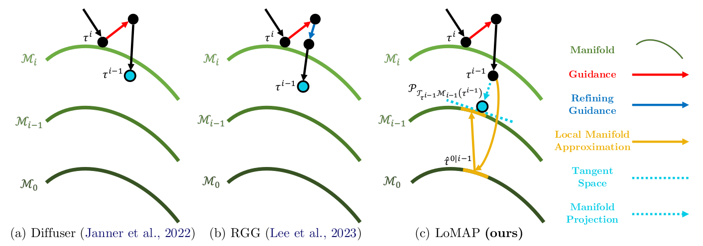

# Local Manifold Approximation and Projection for Manifold-Aware Diffusion Planning

<p align='center'>
    
</p>

This repository provides the source codes for our paper [Local Manifold Approximation and Projection for Manifold-Aware Diffusion Planning](https://arxiv.org/abs/2506.00867) in ICML 2025.

**Update (June 1, 2025):** We released a [SCoTS (State-Covering Trajectory Stitching)](https://github.com/leekwoon/scots), a trajectory augmentation method for diffusion planners that systematically extends trajectory coverage and significantly improves long-horizon planning capabilities on the [OGBench](https://github.com/seohongpark/ogbench) stitching benchmarks. We highly recommend using SCoTS when working with offline datasets containing short, fragmented trajectories that require stitching for long-horizon tasks.

## Setup
We recommend using Python 3.9 with conda:

```bash
# Create a new conda environment
conda create -n lomap python=3.9
conda activate lomap

# Install dependencies
pip install -e .
```

## Training & Inference

Below is an example of how to train and evaluate LoMAP-incorporated Hierarchical Diffuser (HD) on AntMaze tasks:

```bash
# Step 1: Train the diffusion model
python pipelines/lomaphd_d4rl_antmaze.py task=antmaze-large-diverse-v2 mode=train

# Step 2: Prepare data for evaluation
python pipelines/lomaphd_d4rl_antmaze.py task=antmaze-large-diverse-v2 mode=prepare_data

# Step 3: Run inference (evaluation)
python pipelines/lomaphd_d4rl_antmaze.py task=antmaze-large-diverse-v2 mode=inference
```

## Acknowledgements

This repository is extended from [diffuser](https://github.com/jannerm/diffuser) and [CleanDiffuser](https://github.com/CleanDiffuserTeam/CleanDiffuser). 


## Citation
If you find our work useful in your research, please consider citing:
```bibtex
@inproceedings{lee2025local,
  title={Local Manifold Approximation and Projection for Manifold-Aware Diffusion Planning},
  author={Lee, Kyowoon and Choi, Jaesik},
  booktitle={International Conference on Machine Learning},
  year={2025},
}
```
Also consider citing these prior works that helped contribute to this project:
```bibtex
@article{janner2022planning,
  title={Planning with diffusion for flexible behavior synthesis},
  author={Janner, Michael and Du, Yilun and Tenenbaum, Joshua B and Levine, Sergey},
  journal={arXiv preprint arXiv:2205.09991},
  year={2022}
}
@article{dong2024cleandiffuser,
  title={Cleandiffuser: An easy-to-use modularized library for diffusion models in decision making},
  author={Dong, Zibin and Yuan, Yifu and Hao, Jianye and Ni, Fei and Ma, Yi and Li, Pengyi and Zheng, Yan},
  journal={arXiv preprint arXiv:2406.09509},
  year={2024}
}
```


